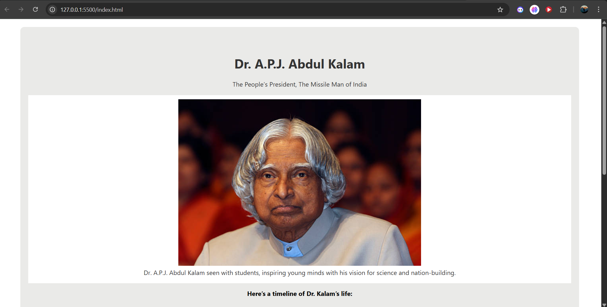

# Tribute Page - Dr. A.P.J. Abdul Kalam

 
  

A clean, responsive, and visually appealing tribute page dedicated to **Dr. A.P.J. Abdul Kalam**, the Missile Man of India.  
This page highlights his life, achievements, an inspiring quote, and provides a link to his Wikipedia page.

---

## 📸 Project Preview

  

---

## 🗂️ Project Structure

tribute-page/ 
│ 
├── index.html # Main HTML file with content and structure 
├── styles.css # CSS file for layout, styling, and responsiveness 
└── README.md # Project documentation

---

## 🖥️ Built With

- **HTML5** – Semantic markup for accessibility and clear structure  
- **CSS3** – Styling, layout, and responsive design  

---

## ⚙️ Features

- Fully responsive design  
- Timeline of Dr. Kalam’s life  
- Inspirational quote section  
- External link to Wikipedia  

---
## Live Demo

[View the live demo](https://nilushan-dev.github.io/tribute-page/)
---

## 👤 Author

**Nilushan Dev** – [GitHub](https://github.com/nilushan-dev)
